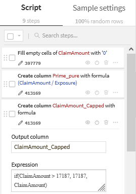

# 🚗 Prédiction de la Fréquence de Sinistres Automobile
> **Projet Data Science & Machine Learning sur Dataiku DSS**  
---

### 📖 Introduction & Jeu de Données
#### 📋 Composition du Dataset
L'étude fusionne deux tables complémentaires liées par un identifiant unique de police :
* **Fréquence (`freMTPLfreq`)** : Caractéristiques de 413 169 polices et nombre de sinistres.
* **Sévérité (`freMTPLsev`)** : Montant financier des sinistres déclarés.  
> [!IMPORTANT]
> **Problématique** : Le défi majeur réside dans la structure statistique de **"sinistralité rare"** et la présence de **sinistres extrêmes (Outliers)** impactant fortement la variance.

#### 🎯 Objectif
Concevoir un pipeline de Machine Learning sous **Dataiku DSS** capable de prédire la fréquence annuelle de sinistres afin d'affiner la segmentation tarifaire et d'optimiser la gestion technique du portefeuille.

### 🛠️ Data Engineering & Actuarial Adjustments
Pour garantir la robustesse du modèle, plusieurs étapes de préparation métier ont été réalisées :

* **Agrégation par ID** : Fusion des lignes de la table de sévérité par `PolicyID` (somme des montants) pour assurer l'unicité du contrat (**1 ligne = 1 assuré**).
* **Imputation des Zéros** : Remplacement des valeurs manquantes par **0** pour **96,3 %** des lignes, transformant une absence de données en une information réelle (absence de sinistre).
* **Capping (Écrêtage) au 99ème percentile (17 187,18 €)** :
    * *Justification* : Réduction drastique de la variance (écart-type initial de 21 612 € vs moyenne de 2 239 €). 
    * *Impact* : Neutralisation des sinistres exceptionnels (jusqu'à 2M€) qui agissent comme du bruit statistique.
* **Calcul de la Prime Pure (`PurePremium_Capped`)** : 
    * *Formule* : `ClaimAmount_Capped / Exposure`
    * *Objectif* : Cette variable normalise le coût du risque par rapport à la durée de présence au contrat. Elle permet de comparer sur une base annuelle un contrat de 15 jours avec un contrat de 12 mois, créant ainsi une cible de tarification homogène.
> **Visualisation du Pipeline :**

> 
*Légende : Flow Dataiku.*
---
> 
*Légende : Boxplot avant le capping.*
---
> 
*Légende : Boxplot après le capping.*
---
Voici un aperçu des transformations actuarielles appliquées :
---
>   
*Légende : Imputation des zéros, calcul de la Prime Pure et le Capping au 99ème percentile.*
---

### 📊 Insights Métier (EDA)

#### 1. Structure du Portefeuille
Le portefeuille est majoritairement composé de conducteurs d'âge moyen (**49% entre 35 et 55 ans**). Le volume des segments extrêmes (> 34 000 polices) permet néanmoins une modélisation robuste des comportements atypiques.

> 
> *Légende : Répartition de l'âge d'assuré.*
#### 2. Analyse de la Sinistralité
* **La Courbe en "U" de l'âge** : Sur-sinistralité marquée chez les jeunes conducteurs (< 25 ans : **0,066**) et remontée chez les seniors (>= 75 ans : **0,044**).
* **Le Paradoxe de la Densité** : Le risque culmine en zone de densité moyenne-haute (**19k-22k**) avec un pic à **0,10**, mais chute en zone d'ultra-densité (> 24k) en raison de la saturation du trafic (congestion).

> 
 ---
> 
 ---

#### 3. Matrice de Corrélation
* **Non-linéarité** : Les corrélations linéaires avec `ClaimNb` sont proches de zéro, justifiant l'utilisation d'algorithmes de **Gradient Boosting** et **Random Forest**.
* **Data Leakage** : Les variables de montants ont été isolées pour éviter toute fuite de données lors de l'entraînement.

> 

---

### 🤖 Modélisation et Résultats
* **Modèles** : Random Forest et XGBoost.
* **Performance** : **MAE de 0,076**.
* **Feature Importance** : La **Densité** et l'**Âge du véhicule** sont les facteurs dominants.

Deux approches algorithmiques ont été comparées : le **Random Forest** (Bagging) pour sa stabilité, et le **XGBoost** (Boosting) pour sa capacité à capturer des signaux complexes. La convergence des deux modèles vers une **MAE de 0,076** valide la qualité du *Feature Engineering*.

**✅ Verdict :** Le pipeline est prêt pour une intégration dans un moteur de tarification technique.

> 

> 

*Légende : Importance des variables par Random Forest.*
---
> 

*Légende : Importance des variables par XGBoost.*
---
 
### 🎯 Pourquoi avoir traité la Sévérité (ClaimAmount) ?
Bien que ce modèle prédise la **Fréquence**, le traitement de la **Sévérité** est stratégique :

1.  **Tarification Globale** : Le dataset est "Prêt à l'emploi" pour calculer la **Prime Pure** ($Fréquence \times Sévérité$).
2.  **Contrôle KPI** : La `PurePremium_Capped` sert d'indicateur de validation pour vérifier la rentabilité des segments prédits.
3.  **Data Hygiène** : Identification indispensable des *outliers* pour ne pas biaiser les futures analyses de risque.

---
