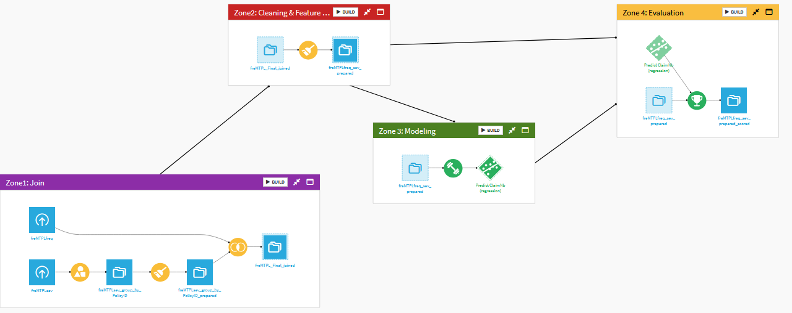
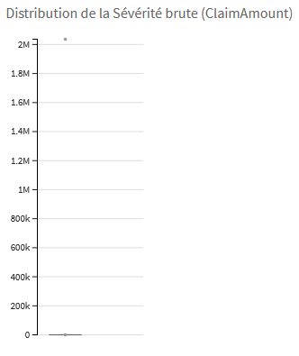
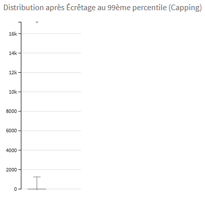
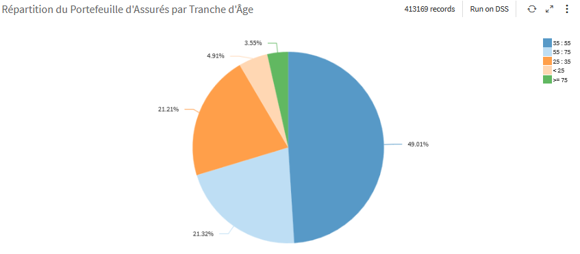
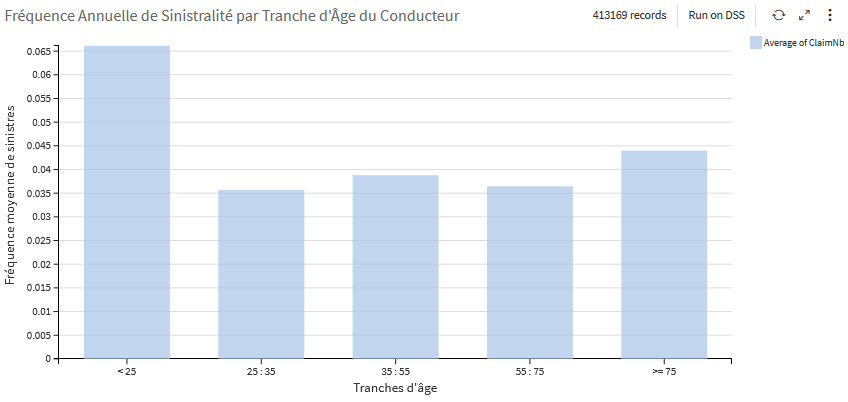
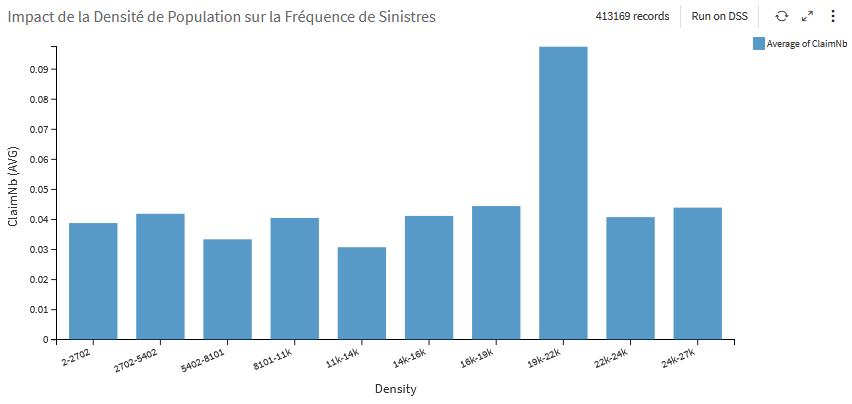
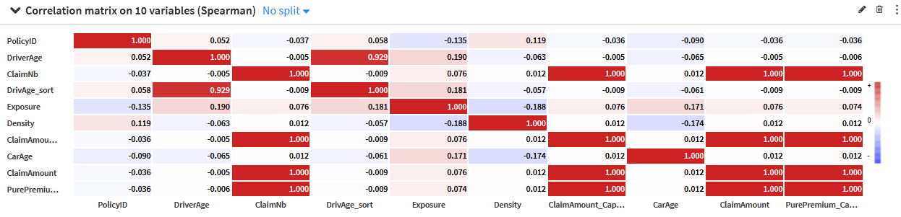
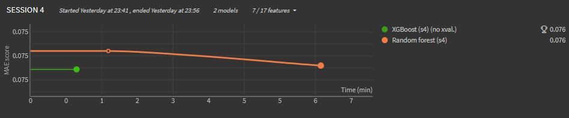
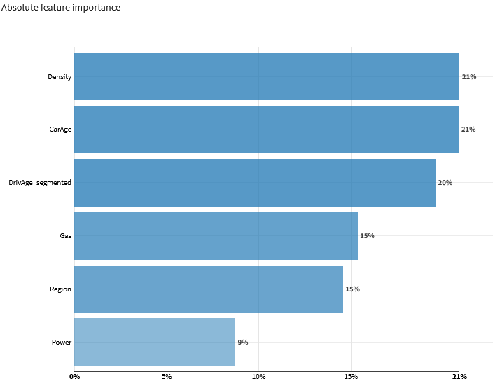
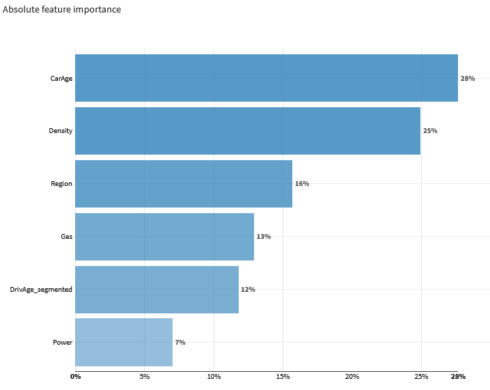

Prédiction de la Fréquence de Sinistres Automobile    
Projet d'Actuariat & Machine Learning sur Dataiku DSS    
💡 Un export complet du projet Dataiku (.zip) est disponible dans le dossier /Export pour réimporter le flow.  
Introduction :  
Objectif : Prédire la fréquence des sinistres pour optimiser la tarification d'un portefeuille d'assurances.  
Dataset : 413 169 polices d'assurance (French Motor TPL).

Data Engineering & Actuarial Adjustments : 

Pour garantir la robustesse du modèle, plusieurs étapes de préparation "métier" ont été réalisées :

Agrégation par ID : Fusion des lignes de la table de sévérité par PolicyID (somme des montants) pour assurer l'unicité du contrat (1 ligne = 1 assuré).  
Imputation des Zéros : Remplacement des valeurs manquantes par 0 pour 96,3 % des lignes, transformant un problème de données manquantes en une information réelle (absence de sinistre).
Capping (Écrêtage) au 99ème percentile (17187,18€) :
         Justification : Réduction de la variance (écart-type initial de 21612€ vs moyenne de 2239 €). Cette étape neutralise les sinistres exceptionnels (jusqu'à 2M€) qui agissent comme du bruit statistique.  
Visualisation du Pipeline :

Insights Métier (EDA) :
1. Structure du Portefeuille  
Le portefeuille est majoritairement composé de conducteurs d'âge moyen (49% entre 35 et 55 ans). Le volume des segments extrêmes (plus de 34 000 polices cumulées) permet cependant une modélisation robuste des comportements atypiques.

3. Analyse de la Sinistralité 
La Courbe en "U" de l'âge : Sur-sinistralité marquée chez les jeunes conducteurs (< 25 ans : 0,066) et remontée chez les seniors (>= 75 ans : 0,044).  
Le Paradoxe de la Densité : Le risque culmine en zone de densité moyenne-haute (19k-22k) avec un pic à 0,10, mais chute en zone d'ultra-densité (> 24k) à cause de la saturation du trafic (congestion).

3. Matrice de Corrélation  
Non-linéarité : Les corrélations linéaires avec ClaimNb sont proches de zéro, justifiant l'utilisation d'algorithmes de Gradient Boosting et Random Forest.  
Data Leakage : Les variables de montants ont été isolées pour éviter toute fuite de données lors de l'entraînement.

 Modélisation et Résultats  
Modèles : Random Forest et XGBoost.  
Performance : MAE de 0,076.  
Feature Importance : La Densité et l'Âge du véhicule sont les facteurs dominants.  
Deux approches algorithmiques ont été comparées : le Random Forest (Bagging) pour sa stabilité, et le XGBoost (Boosting) pour sa capacité à capturer des signaux complexes. La convergence des deux modèles vers une MAE de 0,076 valide la qualité du Feature Engineering.  
Verdict : Le pipeline est prêt pour une intégration dans un moteur de tarification technique.

Pourquoi avoir traité la Sévérité (ClaimAmount) ?  
Bien que ce modèle prédit la Fréquence, le traitement de la Sévérité est stratégique :  
Tarification Globale : Le dataset est "Prêt à l'emploi" pour calculer la Prime Pure.  
Contrôle KPI : La PurePremium_Capped sert d'indicateur de validation pour vérifier la rentabilité des segments prédits.  
Data Hygiène : Identification indispensable des outliers pour ne pas biaiser les futures analyses de risque.

